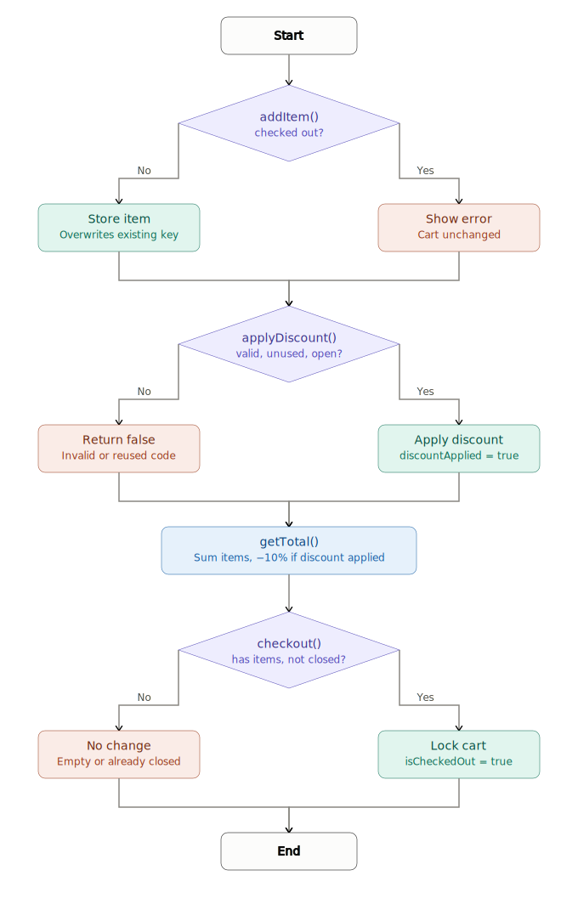

# Grocery Store Billing System

## Overview
A simple Java-based Grocery Store Billing System demonstrating Low-Level Design (LLD) concepts.

## Features
- Add items to shopping cart
- Store items using HashMap
- Apply one-time discount code
- Calculate total bill
- Checkout functionality
- Prevent cart modification after checkout

## Technologies Used
- Java
- HashMap
- Object-Oriented Programming (OOP)

## Files
- Scart.java - Java implementation
- shopping_cart_lld_flowchart.svg - LLD Flowchart

## LLD Flowchart

## Author
*Alagammal Vijayanand*
